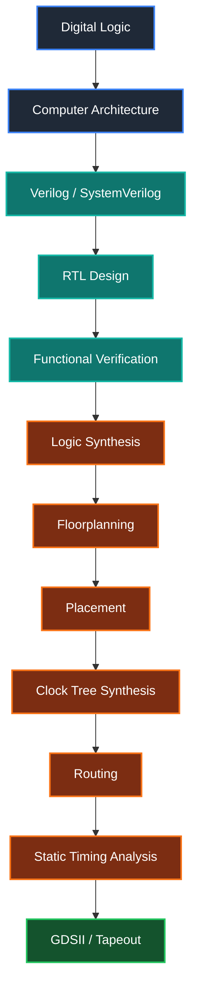

# Hi, I'm Muhammad Taha 👋

### **Computer Engineering Student • Chip Design Intern • Future ASIC Design Engineer**

*"Turning digital logic into silicon, one gate at a time."*

---

## 🚀 About Me

I'm a **Computer Engineering student at UET Taxila** with a growing passion for **Digital IC Design, VLSI, and Semiconductor Engineering**.

I have recently started my journey as a **Chip Design Intern**, where I'm learning the complete digital design flow—from **RTL Design** to **GDSII**. My goal is to develop industry-level expertise in ASIC design and contribute to next-generation semiconductor technologies.

*  Computer Engineering Undergraduate *(Batch of 2027)*
*  Chip Design Intern
*  Exploring **VLSI Design**, **RTL Design**, and the **RTL-to-GDSII Flow**
*  Passionate about Computer Architecture & Digital System Design
*  Aspiring ASIC / Physical Design Engineer

---

## 💡 Current Learning Journey

---

## 🛠️ Tech Stack

### Hardware Design

* Verilog HDL
* SystemVerilog *(Learning)*
* Digital Logic Design
* Computer Architecture
* SAP-1 Computer
* RTL Design

### Programming Languages

* C
* C++
* Python
* Java
* Kotlin

### Tools & Platforms

* Logisim Evolution
* Git & GitHub
* Linux
* VS Code
* MATLAB
* Android Studio

### Exploring

* ASIC Design Flow
* VLSI Design
* Physical Design
* Static Timing Analysis (STA)
* OpenLane
* OpenROAD
* Yosys
* GTKWave

---

##  Featured Projects

###  SAP-1 Computer Architecture

Complete implementation of the SAP-1 educational processor in Logisim, including:

* Control Unit
* ALU
* Registers
* RAM
* Instruction Register
* Program Counter
* Ring Counter
* Custom instruction execution

---

###  Android Development

Built native Android applications using Java and Kotlin with modern UI design and API integration.

---

###  Embedded Systems & IoT

Worked on ESP32, Arduino, and automation-based embedded projects integrating sensors, controllers, and wireless communication.

---

##  2026 Goals

* Master Verilog HDL
* Learn SystemVerilog
* Build a RISC-V Processor
* Complete the RTL-to-GDSII Flow
* Learn Physical Design Fundamentals
* Explore ASIC Verification
* Contribute to Open-Source Hardware Projects
* Build a strong VLSI portfolio

---

## 🌐 Connect With Me

---

### *"Every complex processor begins with a single logic gate. I'm on the journey from RTL to GDSII, building the future of silicon."*

⭐ **Thanks for visiting my profile!**

